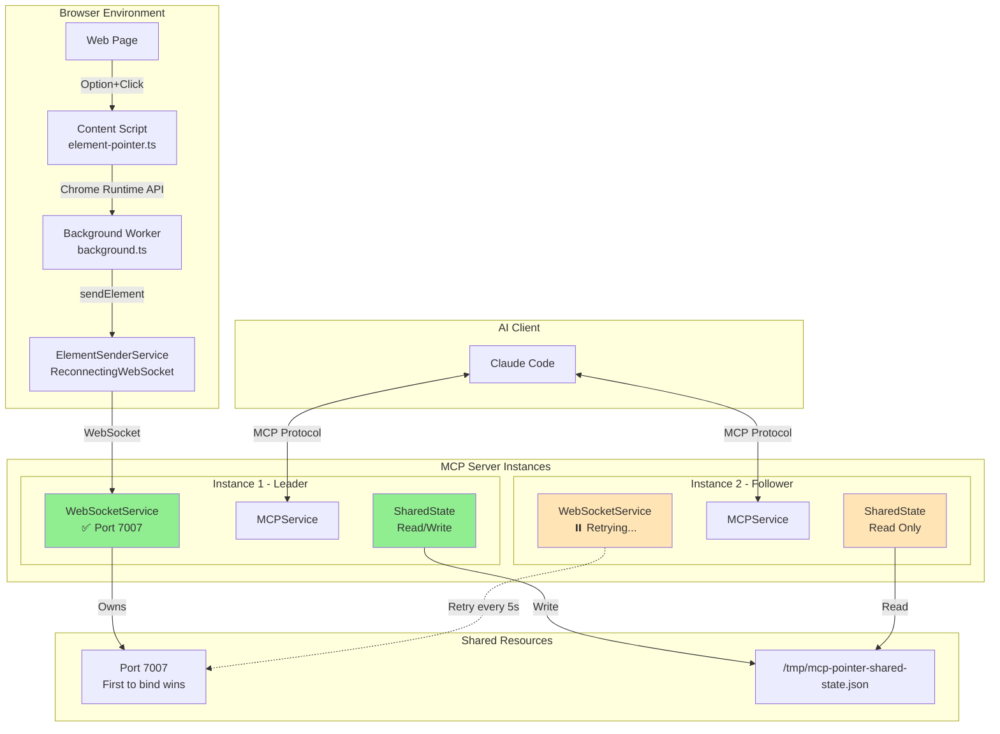
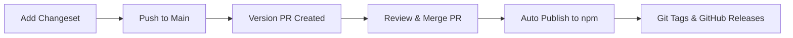

# 🤝 Contributing to MCP Pointer

Thank you for your interest in contributing to MCP Pointer! This guide will help you set up your development environment and understand our contribution process.

## 📋 Prerequisites

Before you begin, make sure you have:

- **Node.js** 18+ installed
- **pnpm** installed (required - see [Package Manager](#package-manager))
- **Chrome** browser for extension testing
- **Claude Code** or another MCP-compatible AI tool for testing

## 📦 Package Manager

**IMPORTANT**: This project uses **pnpm** exclusively for dependency management. Using npm or yarn will not work due to:

- Workspace configuration with `catalog:` dependencies
- Build tooling optimized for pnpm
- Team consistency and lockfile management

### Install pnpm

```bash
# Via npm (if you don't have pnpm)
npm install -g pnpm

# Via Homebrew (macOS)
brew install pnpm

# Via script
curl -fsSL https://get.pnpm.io/install.sh | sh
```

## 📦 Publishing & Build Process

This project uses automated publishing via GitHub Actions with cryptographic provenance for security and transparency.

### Build System
- **Package Manager**: pnpm with workspaces
- **Build Tool**: esbuild for fast TypeScript compilation  
- **CLI Distribution**: Single bundled `.cjs` file for standalone execution
- **Dependencies**: All external packages bundled for zero-dependency installation

### Publishing Workflow
1. **Automated CI**: Every push/PR runs linting, type checking, and builds
2. **GitHub Releases**: Create a release to trigger automatic npm publishing
3. **Provenance**: Cryptographically links published package to source code
4. **Transparency**: Users can verify the published CLI matches the open source code

```bash
# Create a release to publish
git tag v0.1.0
git push origin v0.1.0
# Or use GitHub's release UI
```

## 🏗 Project Structure

```
packages/
├── server/              # @mcp-pointer/server - MCP Server (TypeScript)
│   ├── src/
│   │   ├── start.ts      # Main server entry point
│   │   ├── cli.ts        # Command line interface  
│   │   ├── websocket-server.ts
│   │   └── mcp-handler.ts
│   ├── dist/
│   │   └── cli.cjs       # Bundled standalone CLI
│   └── package.json
│
├── chrome-extension/    # Chrome Extension (TypeScript)
│   ├── src/
│   │   ├── background.ts # Service worker
│   │   ├── content.ts    # Element selection
│   │   └── element-sender-service.ts
│   ├── dev/              # Development build (with logging)
│   ├── dist/             # Production build (minified)
│   └── manifest.json
│
└── shared/             # @mcp-pointer/shared - Shared TypeScript types
    ├── src/
    │   ├── Logger.ts
    │   └── types.ts
    └── package.json
```

## 🚀 Development Setup

### 1. Fork and Clone

```bash
# Fork the repository on GitHub, then clone your fork
git clone https://github.com/etsd-tech/mcp-pointer.git
cd mcp-pointer

# Add upstream remote
git remote add upstream https://github.com/etsd-tech/mcp-pointer.git
```

### 2. Install Dependencies

```bash
# Install all workspace dependencies
pnpm install
```

### 3. Build Everything

```bash
# Build all packages
pnpm build
```

## 🏗 Project Structure

```
packages/
├── server/              # @mcp-pointer/server - MCP Server (TypeScript)
│   ├── src/
│   │   ├── start.ts      # Main server entry point
│   │   ├── cli.ts        # Command line interface  
│   │   ├── websocket-server.ts
│   │   └── mcp-handler.ts
│   ├── dist/
│   │   └── cli.cjs       # Bundled standalone CLI
│   └── package.json
│
├── chrome-extension/    # Chrome Extension (TypeScript)
│   ├── src/
│   │   ├── background.ts # Service worker
│   │   ├── content.ts    # Element selection
│   │   └── element-sender-service.ts
│   ├── dev/              # Development build (with logging)
│   ├── dist/             # Production build (minified)
│   └── manifest.json
│
└── shared/             # @mcp-pointer/shared - Shared TypeScript types
    ├── src/
    │   ├── Logger.ts
    │   └── types.ts
    └── package.json
```

## 🏗️ System Architecture

MCP Pointer uses a distributed architecture with multiple server instances and leader election for high availability:



### How It Works

#### Server-Side (Multiple Instances)

1. **Leader Election:**
   - Multiple MCP server instances can run simultaneously
   - First instance to bind port 7007 becomes the leader
   - Other instances become followers and retry every 5 seconds
   - Automatic failover when leader crashes (~5 second recovery)

2. **State Management:**
   - Leader instance saves element data to `/tmp/mcp-pointer-shared-state.json`
   - All instances (leader and followers) can read shared state
   - MCP requests work on any instance using shared state

3. **Service Architecture:**
   - **WebSocketService**: Handles port-based leader election and WebSocket connections
   - **MCPService**: Provides MCP protocol implementation for AI tools
   - **SharedStateService**: Manages persistent element state via filesystem

#### Client-Side (Browser Extension)

1. **Connection Management (ElementSenderService):**
   - Uses ReconnectingWebSocket library for robust WebSocket connections
   - Exponential backoff: 1s min delay, 10s max delay, 1.5x grow factor
   - Maximum 5 retry attempts per connection
   - 5-second connection timeout
   - Automatic idle disconnection after 2 minutes of inactivity

2. **Element Selection Flow:**
   - Content script captures element data on Option+Click
   - Data sent to background worker via Chrome Runtime API
   - Background worker uses ElementSenderService to send via WebSocket
   - Connection status callbacks provide user feedback (CONNECTING → CONNECTED → SENDING → SENT)

3. **Resilience Features:**
   - Automatic reconnection during server restarts or leader changes
   - Port change handling (disconnects old, connects to new)
   - Connection status monitoring with detailed logging
   - Graceful error handling with status reporting

## 🛠 Development Workflow

### Chrome Extension Development

1. **Build extension in development mode**:
   ```bash
   cd packages/chrome-extension
   pnpm dev  # Builds to dev/ directory with logging enabled and source maps
   ```

2. **Load extension in Chrome**:
   - Open Chrome → Extensions → Developer mode → Load unpacked
   - Select `packages/chrome-extension/dev/` folder
   - The extension will appear in your browser

3. **Making changes**:
   - Files are watched automatically in dev mode
   - Refresh the extension in Chrome Extensions page after changes
   - Check browser console for development logs

4. **Development vs Production**:
   - **Dev build** (`pnpm dev`) → `dev/` folder, includes logging and source maps
   - **Production build** (`pnpm build`) → `dist/` folder, minified, no logs

### MCP Server Development

1. **Run MCP server in watch mode**:
   ```bash
   cd packages/server
   pnpm dev  # Starts server and restarts on file changes
   ```

2. **Test server locally**:
   ```bash
   # In a separate terminal
   node dist/cli.cjs --help  # Test the built CLI
   ```

3. **Configure for development**:
   ```bash
   pnpm -C packages/server configure  # Auto-configure Claude Code
   ```

### Development Commands

```bash
# Build everything for production
pnpm build

# Run linting and type checking
pnpm lint
pnpm typecheck

# Fix linting issues automatically  
pnpm lint:fix

# Clean all build outputs
pnpm -C packages/chrome-extension clean
pnpm -C packages/server clean

# Run development servers for all packages
pnpm dev
```

## 🧪 Testing

### Testing Checklist

Before submitting a PR, ensure:

- [ ] MCP server starts with `mcp-pointer start`
- [ ] Chrome extension loads without errors
- [ ] Option+Click highlights elements on webpages
- [ ] Claude Code shows the `getTargetedElement` tool
- [ ] Element data appears when using the tool
- [ ] WebSocket connection indicator shows "Connected"
- [ ] All existing tests pass
- [ ] New functionality is tested

### Testing Different Scenarios

1. **Test on different websites** - try React apps, Vue apps, plain HTML
2. **Check component detection** - React Fiber info should appear for React apps
3. **Test responsive elements** - resize browser and check highlighting
4. **Verify CSS extraction** - ensure styles and positions are captured
5. **Test edge cases** - very small elements, overlapping elements, etc.

### Browser Testing

- ✅ **Chrome** - Primary target, test thoroughly
- ✅ **Edge** - Should work identically to Chrome
- 🟡 **Firefox** - Extension needs adaptation (contributions welcome)
- 🟡 **Safari** - Extension needs adaptation (contributions welcome)

## 📝 Code Style

### General Guidelines

- Use **TypeScript** for all code
- Follow existing code patterns and conventions
- Use **esbuild** for compilation (already configured)
- Include JSDoc comments for public APIs
- Prefer explicit types over `any`

### Formatting

- We use **ESLint** for code formatting and linting
- Run `pnpm lint:fix` before committing
- All code must pass `pnpm typecheck`

### File Naming

- Use **kebab-case** for file names: `element-sender-service.ts`
- Use **PascalCase** for classes and components
- Use **camelCase** for functions and variables

## 🔄 Making Changes

### Branch Naming

```bash
# Feature branches
git checkout -b feature/add-firefox-support
git checkout -b feature/improve-react-detection

# Bug fix branches  
git checkout -b fix/websocket-reconnection
git checkout -b fix/element-highlighting-edge-case

# Documentation
git checkout -b docs/update-contributing-guide
```

### Commit Messages

Use conventional commit format:

```
type(scope): description

Examples:
feat(extension): add Firefox support
fix(server): handle WebSocket reconnection
docs(readme): update installation instructions
refactor(shared): improve TypeScript types
test(extension): add element selection tests
```

### Pull Request Process

1. **Keep PRs focused** - One feature or fix per PR
2. **Update documentation** - Update README or other docs if needed  
3. **Add tests** - Include tests for new functionality
4. **Check all builds pass** - Ensure `pnpm build` works
5. **Run quality checks**:
   ```bash
   pnpm lint
   pnpm typecheck
   pnpm build
   ```

### PR Description Template

```markdown
## Summary
Brief description of what this PR does

## Changes Made
- List key changes
- Include any breaking changes
- Mention new dependencies

## Testing
- [ ] Tested locally with Chrome extension
- [ ] Tested MCP server functionality  
- [ ] Tested with Claude Code integration
- [ ] All existing tests pass

## Screenshots (if applicable)
Include screenshots for UI changes
```

## 🐛 Troubleshooting Development Issues

### Common Issues

1. **Build failures**:
   - Make sure you're using pnpm, not npm/yarn
   - Run `pnpm install` to refresh dependencies
   - Check for TypeScript errors with `pnpm typecheck`

2. **Extension not loading**:
   - Verify you built with `pnpm -C packages/chrome-extension build`
   - Check the `dist/` or `dev/` folder contains files
   - Reload extension in Chrome Extensions page

3. **WebSocket connection issues**:
   - Ensure MCP server is running (`mcp-pointer start`)
   - Check port 7007 is not blocked
   - Look for connection errors in browser console

4. **MCP tools not appearing in Claude Code**:
   - Restart Claude Code after configuration changes
   - Verify `.mcp.json` exists and is valid
   - Check MCP server logs for errors

### Getting Help

- Check existing [GitHub Issues](https://github.com/etsd-tech/mcp-pointer/issues)
- Create a new issue with:
  - Clear description of the problem
  - Steps to reproduce
  - Environment details (OS, Node version, etc.)
  - Error messages or logs

## 📋 Release Process

This project uses **Changesets** for automated versioning and publishing. Contributors add changeset files to describe their changes, and maintainers manage releases through automated PRs.

### Using Changesets

When you make changes that should trigger a new release, add a changeset:

```bash
# Add a changeset describing your changes
pnpm changeset
```

This will prompt you to:
1. **Select packages** that should be updated
2. **Choose version bump type** (patch/minor/major)
3. **Write a summary** of your changes

Example changeset session:
```
🦋  Which packages would you like to include?
◉ @mcp-pointer/server
◉ @mcp-pointer/shared
◯ @mcp-pointer/chrome-extension

🦋  Which packages should have a major bump?
◯ @mcp-pointer/server
◯ @mcp-pointer/shared

🦋  Which packages should have a minor bump?  
◉ @mcp-pointer/server
◯ @mcp-pointer/shared

🦋  Please enter a summary for this change
Added WebSocket connection retry logic with exponential backoff
```

### Version Types

- **Patch** (0.1.0 → 0.1.1): Bug fixes, small improvements
- **Minor** (0.1.0 → 0.2.0): New features, backwards compatible
- **Major** (0.1.0 → 1.0.0): Breaking changes

### Creating a Release

**For maintainers only:**

1. **Review pending changesets** in `.changeset/` folder
2. **Push to main** - GitHub Actions will create a "Version Packages" PR
3. **Review the Version PR** - Check version bumps and changelog
4. **Merge the Version PR** - Packages are published automatically

The automated workflow:
- Creates git tags (e.g., `@mcp-pointer/server@0.3.1`)  
- Publishes to npm with provenance
- Creates GitHub releases with changelogs
- Handles monorepo versioning automatically

### Release Workflow



## 🎯 Contribution Ideas

Looking for ways to contribute? Here are some ideas:

### 🚀 Features
- Firefox extension support
- Safari extension support  
- Additional framework detection (Svelte, Angular)
- Element search and filtering
- Export element data to different formats
- Integration with other AI tools

### 🐛 Bug Fixes
- Improve element highlighting accuracy
- Handle edge cases in component detection
- WebSocket connection stability
- Performance optimizations

### 📚 Documentation
- More comprehensive examples
- Video tutorials
- Integration guides for different AI tools
- Translation to other languages

### 🧪 Testing
- Unit tests for core functionality
- Integration tests
- Cross-browser testing
- Performance testing

## 📄 License

By contributing to MCP Pointer, you agree that your contributions will be licensed under the MIT License.

---

**Thank you for contributing to MCP Pointer! 👆**

Every contribution helps make web development with AI more powerful and accessible.